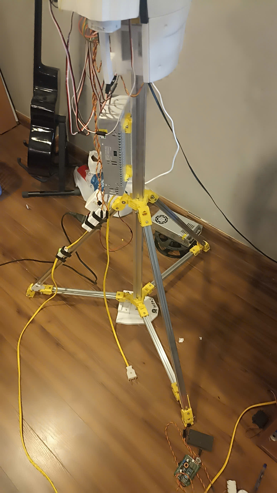
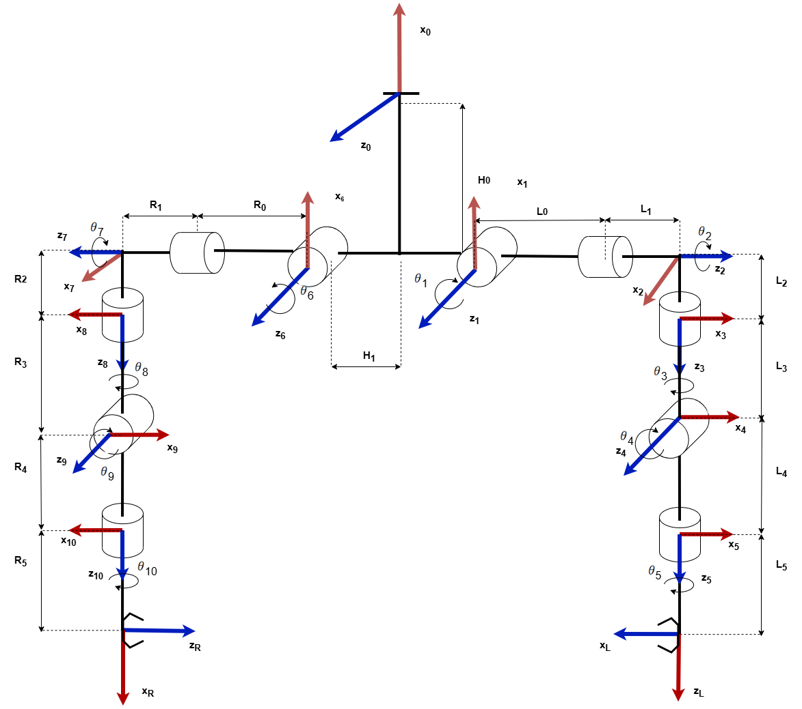

# Humandroid Project

> **Note:** This project is my **Graduation Project** (Đồ án tốt nghiệp). It showcases the integration of Artificial Intelligence and hardware control in building a humanoid robot system.

 

## Introduction
The **Humandroid** project is a humanoid robot system integrated with Artificial Intelligence (AI). The project includes various components such as Computer Vision, Natural Language Processing (AI Assistant), Inverse Kinematics (IK), and hardware module control including the robot's arms, head, and LED lighting system.

This project serves as a comprehensive demonstration of blending software algorithms with physical hardware to create an interactive robotic system.

### 🌟 Open Source Contribution (InMoov)
This project is deeply inspired by and contributes to the **[InMoov](http://inmoov.fr/)** project, the first open-source 3D printed life-size robot. By leveraging the InMoov mechanical design, Humandroid extends its capabilities with advanced AI modules, inverse kinematics, and modern computer vision systems, aiming to give back to the open-source robotics community.

## System Architecture

Below is the high-level system architecture of the Humandroid:



And the hardware circuit diagram:


## Key Features
- 🧠 **AI Assistant:** An integrated virtual assistant utilizing LLM (OpenAI) for natural communication and task planning.
- 👁️ **Robot Vision:** Capability to recognize images and perceive the surrounding environment.
- 🦾 **Kinematics Control:** Uses Inverse Kinematics (`IK.py`) algorithms to control the robotic arms smoothly.
- 🗣️ **Audio Communication:** Features listening capabilities (`AI_Listen`) and speech generation (`AI_speak`).
- 🎮 **Hardware Modules:** Flexible control of the Head, Hand, and LED lighting systems.
- 🖥️ **Debug/Monitor Interface:** A 3.5-inch LCD screen and software interface for monitoring system status.

## Directory Structure
```text
humandroid/
├── AI/                     # AI related scripts (Planner, Chatbot, API calls)
├── Manager/                # Manages robot states and tasks
├── Prompt/                 # Text prompts for AI
├── Source/                 # Auxiliary source files (Audio, Models...)
├── Vision/                 # Image processing and computer vision
├── image/                  # Contains project images and charts
├── config.yaml             # System configuration (paths, audio devices)
├── AI_assisstant.py        # Main AI assistant script
├── IK.py                   # Inverse Kinematics for the robotic arm
├── Robot_Vision.py         # Computer vision script
├── Robot_handcontrol.py    # Arm control script
├── Robot_headcontrol.py    # Head control script
├── Robot_lightcontrol.py   # LED control script
└── main.py                 # Main execution file
```

## System Requirements
- **Hardware:**
  - Microphone (USB PnP Sound Device)
  - Speaker (`plughw:CARD=MAX98357A,DEV=0`)
  - 3.5-inch LCD Screen (Optional)
  - Servo modules for arms, head, mouth, etc.
- **Software:**
  - Python 3.x
  - OpenAI API Key (configured via `OPENAI_API_KEY` environment variable)
  - Required Python libraries (listed in `requirements.txt`)

## Installation
1. Clone this repository:
   ```bash
   git clone https://github.com/Longh2212/Humandroid.git
   cd humandroid
   ```
2. Create a virtual environment:
   ```bash
   python -m venv venv
   source venv/bin/activate  # On Windows: venv\Scripts\activate
   ```
3. Install the required dependencies:
   ```bash
   pip install -r requirements.txt 
   ```
4. Set up the API Key:
   Create a `.env` file in the root directory and add your key:
   ```env
   OPENAI_API_KEY=your_api_key_here
   ```

## Usage
Run the main execution file:
```bash
python main.py
```

## Author
- **Hoàng Hưng Long** - *Project Lead / Developer* - [GitHub](https://github.com/Longh2212)

## License
This project is licensed under the [MIT](LICENSE) License. See the `LICENSE` file for more details.
